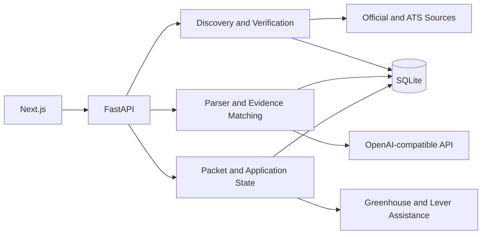

# JobFlow Agent

面向国内校招与实习场景的证据约束求职 Agent。系统以确定性的
`PLAN -> ACT -> OBSERVE` 流程发现和分析岗位，将模型能力限制在 JD
解析、语义匹配与材料建议中，并把来源验证、资格规则、用户审批、状态转换和
最终提交交给可测试的确定性代码。

> 当前版本：`v0.4 Assisted Apply`。支持 SQLite 单机本地运行；不承诺公网多用户
> 托管、任意 ATS 兼容、无人值守批量投递或绕过登录与反自动化控制。


## 核心能力

### 1. 可信岗位发现

- 先持久化来源白名单、工具顺序、调用预算和停止条件，再执行搜索；
- 已适配来源优先使用官方 Adapter，失败后按计划回退；
- 搜索摘要和第三方线索只能创建待验证 `JobLead`，不能直接成为可信岗位；
- 统一执行 URL 安全检查、正文验证、标准化、去重和岗位开放状态审计；
- 每次运行保留 Plan、Act、Observe、Fallback 与 Stop 轨迹。

### 2. 证据约束的 JD 解析与匹配

- 使用 Core/Detail 两阶段 Parser，降低单次结构化输出复杂度；
- Core Parser 先输出带原文片段的技能条款，再一次性编译为必备、优先、提及和备选组；
- 以 Pydantic Schema、字段级原文证据和一致性检查约束模型输出；
- 匹配结论必须引用当前用户的经历证据 ID，并校验归属与事实一致性；
- 无有效证据的结论降级为 `unsupported`；
- 届别、地点、学历等硬性资格由规则判断，不交给模型自由决定。

### 3. 可审核的申请流程

- 简历、答案与投递包使用不可变版本，审批后不允许原地修改；
- Application、Packet、Attempt、Receipt 和 Follow-up 分别记录业务状态；
- 敏感字段需要用户明确确认，ATS 提交授权一次有效且绑定具体任务；
- 遇到登录、CAPTCHA、2FA、页面变化或无法确认的字段时暂停并请求接管；
- 只有校验到有效回执后，Application 才能进入 `SUBMITTED`。

## 工作流

```text
求职目标
  -> 来源白名单与 Search Plan
  -> 官方来源 / ATS Adapter / 受控页面读取
  -> JobLead 验证、标准化与去重
  -> Core + Detail JD Parser
  -> 资格规则 + 经历证据匹配
  -> 用户选择并创建 Application
  -> 材料审批与投递包冻结
  -> 人工操作或有限 ATS 辅助
  -> 有效 Receipt
  -> SUBMITTED 与后续跟进
```

职责边界：

| 参与方 | 负责内容 |
| --- | --- |
| Agent | 理解求职目标、解析 JD、语义匹配、生成材料建议 |
| 确定性代码 | Schema 校验、资格规则、URL 安全、预算、状态机、授权与凭证 |
| 用户 | 确认敏感事实、审批材料、决定是否申请和提交 |

## 架构



后端采用模块化单体结构，通过 `api / domain / services / infrastructure` 保持边界；
SQLite 是当前唯一支持的业务数据库。前端以工作区形式覆盖岗位发现、材料库、投递包、
投递尝试、ATS 辅助与后续跟进。

## 评测结果

| 评测 | 数据范围 | 结果 | 适用边界 |
| --- | --- | ---: | --- |
| Staged JD Parser | 基于公开招聘页面构建的 39 条严格子集（规则标签 + 人工覆盖） | Macro-F1 `0.9897` | 仅岗位类型、地点和必备技能三个字段 |
| Core JD Parser v28 | 冻结 dev-21，五字段 | Macro-F1 `0.9549` | 真实 DeepSeek 输出经 v28 确定性归一化重放；开发集，不是最终 holdout |
| Discovery Agent | 13 个离线控制面 Fixture | `13/13` | 来源授权、路由、回退、预算与轨迹 |
| Trusted Discovery | 9 个离线确定性 Fixture | `9/9` | 正文验证、去重、开放状态与人工接管 |
| Assisted Apply | 14 个 Greenhouse/Lever Mock ATS 场景 | `14/14` | 字段映射、接管、授权与提交凭证 |
| 浏览器回归 | Chromium 桌面端与移动端 | `20/20` | 关键本地用户流程 |

Parser 的 39 条岗位原文因来源授权边界未提交到仓库，公开内容包括评测代码、标签覆盖、
指标定义和聚合结果，因此该结果不是可从仓库独立还原原始数据的公共 Benchmark。
Fixture 通过率也不代表真实官网召回率、真实 ATS 兼容率或线上投递成功率。

另有一份 [165 条 AI 校招与实习岗位元数据目录](datasets/AI_CAMPUS_DATASET_2026_08_31.md)，
覆盖 25 家公司；其中 154 条已完成人工字段覆盖。当前已在固定的 21 条开发集上完成
真实模型输出评测；密封 holdout 仍未运行。dev-21 结果用于冻结实现和调试，不能当作
最终测试集成绩。版本与复现实验边界见
[v28 dev-21 冻结说明](datasets/AI_CAMPUS_CORE_V28_DEV21_FREEZE_2026_09_02.md)。

详细口径与机器可读结果：

- [JD Parser 评测](docs/EVALUATION.md)
- [Discovery Agent 控制面评测](docs/DISCOVERY_AGENT_EVALUATION.md)
- [可信岗位发现评测](docs/TRUSTED_DISCOVERY_EVALUATION.md)
- [Assisted Apply 评测](docs/evaluation/m19-assisted-apply-summary.md)

## 快速开始

环境要求：

- Python 3.12；
- [uv](https://docs.astral.sh/uv/)；
- Node.js 22 与 npm；
- Windows PowerShell，或分别启动前后端。

默认配置使用 Fake Model Provider，不需要 API Key 即可运行本地界面和测试。

### Windows 一键启动

```powershell
Copy-Item .env.example .env
powershell -ExecutionPolicy Bypass -File scripts/start-dev.ps1
```

打开 `http://localhost:3000`。后端默认运行在 `http://127.0.0.1:18001`。

### 可选：浏览器能力

基础界面和 Fake Model 演示不依赖浏览器组件。使用动态岗位页面读取或 ATS
浏览器辅助时，在项目根目录安装 Python Playwright 对应的 Chromium：

```powershell
uv run playwright install chromium
```

运行前端 Playwright E2E 时，另行安装 Node.js Playwright 对应的 Chromium：

```powershell
Set-Location frontend
npx playwright install chromium
```

### 分别启动

后端：

```powershell
Copy-Item .env.example .env
uv sync --frozen
uv run alembic upgrade head
uv run uvicorn src.main:app --reload --host 127.0.0.1 --port 18001
```

前端：

```powershell
Set-Location frontend
Copy-Item .env.example .env.local
npm ci
npm run dev
```

接入 OpenAI-compatible 模型时，在 `.env` 中配置：

```dotenv
STRUCTURED_MODEL_PROVIDER=openai_compatible
LLM_BASE_URL=https://your-provider.example/v1
LLM_API_KEY=your-api-key
LLM_MODEL=your-model
```

`.env`、本地数据库、私密材料和评测原始输出均已排除在版本控制之外。

## 验证

```powershell
uv run alembic upgrade head
uv run pytest -q
uv run ruff check .

Set-Location frontend
npm run typecheck
npm run build
npm run test:e2e
```

GitHub Actions 会从空 SQLite 文件执行迁移，并运行后端测试、Ruff、前端类型检查、
生产构建和 Playwright 桌面/移动端回归。

## 项目结构

```text
src/
  api/             FastAPI 路由与请求契约
  domain/          状态机、实体与领域规则
  services/        发现、解析、匹配、材料和投递流程
  infrastructure/  SQLite 与模型客户端
  evaluation/      可重复评测入口和指标
frontend/          Next.js 工作区与 Playwright E2E
migrations/        Alembic SQLite 迁移
datasets/           版本化 Fixture、Manifest 与标签覆盖
docs/               架构、评测和完整技术参考
tests/              后端单元、服务与端到端测试
```

## 安全与范围

- 招聘网页始终按不可信输入处理，页面文字不能覆盖系统约束；
- 网络读取限制协议、主机、重定向、响应大小、超时和重试预算；
- 私密简历保存在非静态目录，日志对密钥、令牌、邮箱和手机号脱敏；
- 本地 `AUTH_MODE=local` 仅用于开发，staging/production 会进行 fail-closed 配置检查；
- 系统不绕过登录、CAPTCHA、Cloudflare、2FA 或其他反自动化控制；
- 无人值守批量投递、任意 ATS 和公网多租户部署不在 `v0.4` 范围内。

## 延伸阅读

- [完整技术参考](docs/TECHNICAL_REFERENCE.md)
- [开发流程与模块边界](docs/DEVELOPMENT_WORKFLOW.md)
- [里程碑与实现记录](docs/IMPLEMENTATION_HISTORY.md)
- [真实模型验收说明](docs/REAL_MODEL_ACCEPTANCE.md)
- [安全策略](SECURITY.md)
- [CI 发布门禁](.github/workflows/ci.yml)

## License

本项目采用 [MIT License](LICENSE)。
